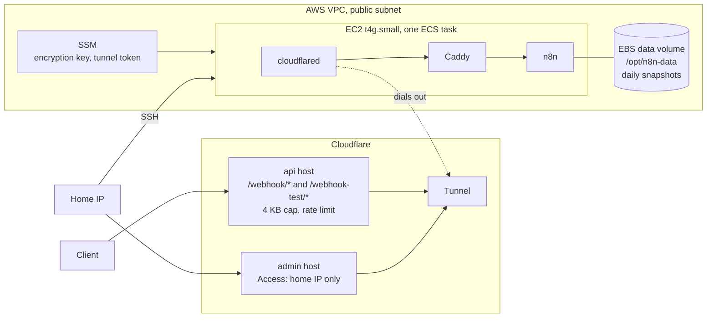

# Networking

```mermaid
flowchart LR
  client[Client]
  home[Home IP]

  subgraph cf[Cloudflare]
    api["api host<br/>/webhook/* and /webhook-test/*<br/>4 KB cap, rate limit"]
    admin["admin host<br/>Access: home IP only"]
    tunnel[Tunnel]
  end

  subgraph aws["AWS VPC, public subnet"]
    subgraph ec2["EC2 t4g.small, one ECS task"]
      cfd[cloudflared] --> caddy[Caddy] --> n8n[n8n]
    end
    ebs[("EBS data volume<br/>/opt/n8n-data<br/>daily snapshots")]
    ssm["SSM<br/>encryption key, tunnel token"]
  end

  client --> api
  home --> admin
  api --> tunnel
  admin --> tunnel
  cfd -. dials out .-> tunnel
  n8n --- ebs
  ssm --> ec2
  home -- SSH --> ec2
```

The instance has no web port open.
`cloudflared` dials out to Cloudflare, and requests come back through that connection to Caddy.
SSH from the home IP is the only inbound rule.
