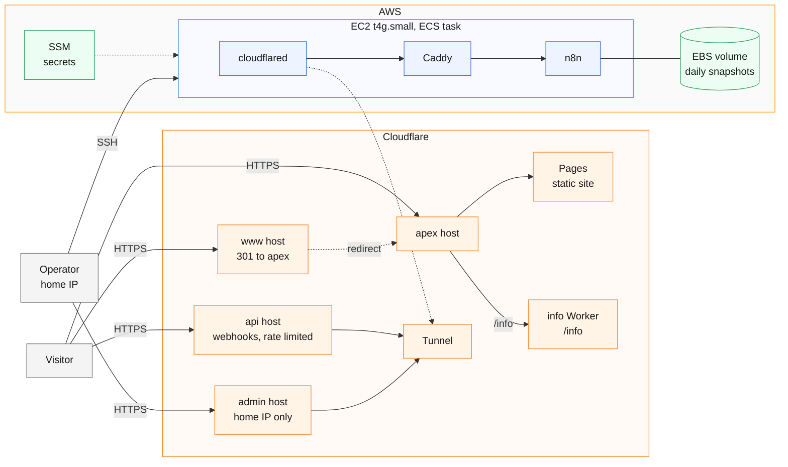

# Networking

```mermaid
flowchart LR
  visitor["Visitor"]
  operator["Operator<br/>home IP"]

  subgraph cf["Cloudflare"]
    direction TB
    apiHost["api host<br/>webhooks, rate limited"]
    adminHost["admin host<br/>home IP only"]
    wwwHost["www host<br/>301 to apex"]
    apexHost["apex host"]
    pages["Pages<br/>static site"]
    worker["info Worker<br/>/info"]
    tunnel["Tunnel"]
  end

  subgraph aws["AWS"]
    subgraph ec2["EC2 t4g.small, ECS task"]
      direction LR
      cloudflared["cloudflared"] --> caddy["Caddy"] --> n8n["n8n"]
    end
    ebs[("EBS volume<br/>daily snapshots")]
    ssm["SSM<br/>secrets"]
  end

  visitor -->|HTTPS| apexHost
  visitor -->|HTTPS| wwwHost
  wwwHost -.->|redirect| apexHost
  apexHost --> pages
  apexHost -->|/info| worker
  visitor -->|HTTPS| apiHost
  operator -->|HTTPS| adminHost
  apiHost --> tunnel
  adminHost --> tunnel
  cloudflared -.-> tunnel
  n8n --- ebs
  ssm -.-> ec2
  operator -->|SSH| ec2

  classDef external fill:#f4f4f5,stroke:#71717a,color:#18181b
  classDef cloudflare fill:#fff4e6,stroke:#f38020,color:#18181b
  classDef compute fill:#eef4ff,stroke:#3b6fd8,color:#18181b
  classDef data fill:#ecfdf3,stroke:#2f9e5b,color:#18181b

  class visitor,operator external
  class apiHost,adminHost,wwwHost,apexHost,pages,worker,tunnel cloudflare
  class cloudflared,caddy,n8n compute
  class ebs,ssm data

  style cf fill:#fffaf5,stroke:#f38020,color:#18181b
  style aws fill:#fafafa,stroke:#ff9900,color:#18181b
  style ec2 fill:#f8faff,stroke:#3b6fd8,color:#18181b
```
